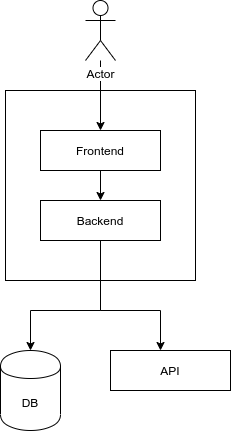
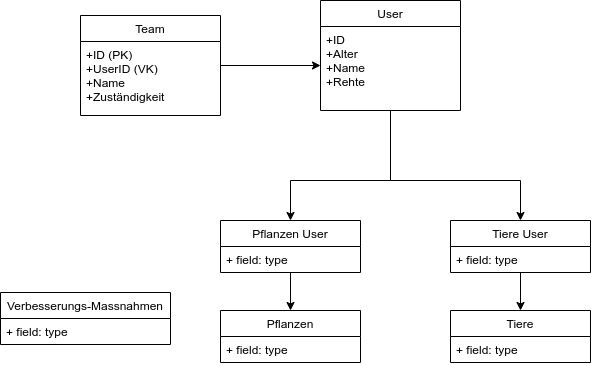

# anderScore Vortrag BPI 2023 - Kursmaterialien

Materialien:
- [Flyer](RecruitFlyer.pdf)
- [Präsentation](Praesentation.pdf)

Links: 
- [anderScore.com](https://www.anderscore.com/)
- [Job's bei anderScore](https://anderscore.com/jobs/)

## Wie würdet ihr bei der Entwicklung dieser Anwendung vorgehen
-	Anforderungsanalyse, welche Daten erfasst werden sollen
-	Wie soll der Kunde auf die Anwendung zugreifen können
-	Können Libraries für die Entwicklung verwendet werden
-	Wie sollen die Daten gespeichert werden 
-	Wie sieht die Sicherheit aus? Zugriff auf die Software
-	Struktur aufbauen, wie ich die Anwendung aufbauen will
-	Gibt es eine Datenbank
-	Gibt es ein Backend
-	Welche Schnittstellen soll es geben 
-	Wie sieht das Frontend aus
-	Design von Architektur und Design

## Welche Artefakte müssen angefertigt werden?
-	Dokumentation, Lastenheft (Stammdaten)
-	PoC’s (Proof of Concepts)
-	Anforderungsanalyse
-	ER-Diagramm
-	Architekturmodell
-	Use-Case-Diagramm
-	UI-Design
-	Prototypen

## Architekturmodell
- [Architekturmodell draw.io](Architekturmodell.drawio)
- [Architekturmodell png](Architekturmodell.png)

## ER-Diagramm
- [ER-Diagramm draw.io](ER-Diagramm.drawio)
- [ER-Diagramm png](ER-Diagramm.png)

